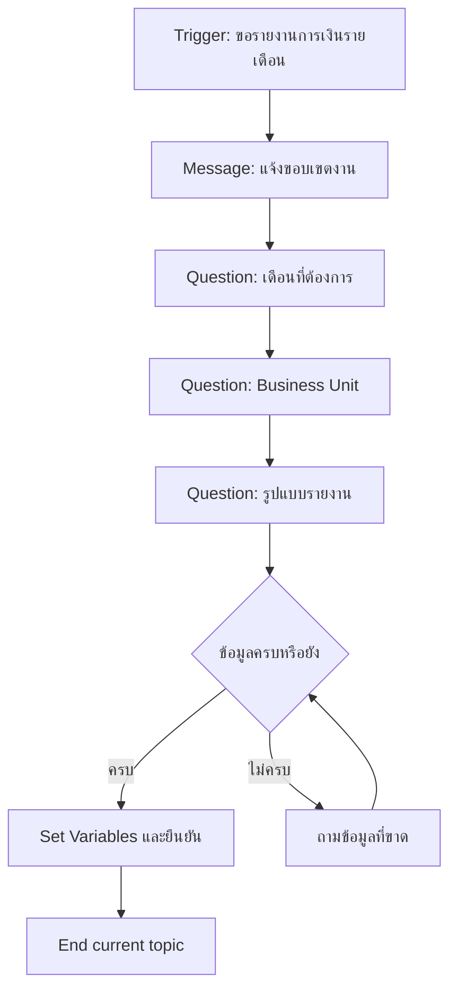

# แบบฝึกหัดที่ 1: ออกแบบ Topic รับความต้องการรายงานการเงิน

🔑 **ต้องการ M365 Copilot License + สิทธิ์เข้าใช้ Copilot Studio**

แบบฝึกหัดนี้จะพาเราสร้าง Topic แรกของ **Financial Monthly Report Agent** เพื่อรับข้อมูลจากผู้ใช้ให้ครบก่อนเริ่มวิเคราะห์ เช่น เดือน, หน่วยงาน, และเป้าหมายรายงาน และจะเป็นฐานเดียวกันที่เราเอาไปต่อยอดในแบบฝึกหัดถัดไป



---

## Feature 1: สร้าง Topic และ Trigger phrases

1. เข้า [https://copilotstudio.microsoft.com](https://copilotstudio.microsoft.com) แล้วเปิด Agent ของคุณ
2. ไปที่ **Topics** และกด **Add a topic**
   
3. จากด้านบนซ้าย คลิกตั้งชื่อ Topic ว่า `Monthly Report Intake`
   
4. ใน Trigger node ให้เพิ่ม Trigger phrases เช่น:

   ```
   ช่วยสรุปรายงานการเงินรายเดือน
   ขอรายงานเดือนนี้ของ BU GC
   สรุปผลการเงินประจำเดือนให้หน่อย
   ```

> 💡 **Tip:** ให้ใส่ Trigger phrases หลายรูปแบบทั้งทางการและภาษาพูด เพื่อให้ Topic ติดได้เสถียรมากขึ้น

---

## Feature 2: ออกแบบคำถามเก็บข้อมูลด้วย Question node

1. เพิ่ม **Message** node เพื่อบอกผู้ใช้ว่า Agent จะเก็บข้อมูลก่อนสร้างรายงาน
2. เพิ่ม **Question** node เพื่อเก็บข้อมูลต่อไปนี้:
   - เดือนหรือช่วงเวลา
   - ชื่อหน่วยงานหรือ Business Unit
   - รูปแบบผลลัพธ์ (Executive summary, KPI summary, Detailed)
3. บันทึกคำตอบแต่ละข้อไว้ในตัวแปร เช่น:
   - `Topic.ReportPeriod`
   - `Topic.BusinessUnit`
   - `Topic.ReportFormat`

---

## Feature 3: เช็คความครบถ้วนด้วย Condition node

1. เพิ่ม **Condition** node ตรวจว่าแต่ละตัวแปรมีค่าหรือไม่
2. ถ้าข้อมูลยังไม่ครบ ให้ส่งผู้ใช้กลับไปเติมข้อมูลที่ขาด
3. ถ้าข้อมูลครบ ให้เพิ่ม **Message** node ยืนยันค่าทั้งหมดก่อนจบ Topic

   ```
   รับข้อมูลเรียบร้อย: เดือน = {Topic.ReportPeriod}, BU = {Topic.BusinessUnit}, รูปแบบ = {Topic.ReportFormat}
   ```

> ⚠️ **Note:** หากคำตอบผู้ใช้มีโอกาสชนกับ Trigger ของ Topic อื่น ให้ปรับ Question node interruption behavior ตามความเหมาะสม

---

## Feature 4: ทดสอบ Topic รอบแรก

1. เปิดหน้าต่าง **Test** ด้านขวา
2. ทดสอบด้วยคำสั่ง:

   ```
   ช่วยทำรายงานการเงินรายเดือนให้ BU Aromatics
   ```

3. ตรวจสอบว่า Agent ถามข้อมูลที่ขาดครบและไหลตามแผน
4. บันทึกสิ่งที่ต้องปรับ 2-3 จุด เช่น คำถามไม่ชัด, ตัวแปรชื่ออ่านยาก

---

## สรุป

ในแบบฝึกหัดนี้ คุณได้สร้าง Topic intake สำหรับงานรายงานการเงิน โดยใช้ Trigger, Question, Variable, และ Condition node ครบเส้นทางพื้นฐาน

ขั้นตอนถัดไป → [เชื่อมข้อมูล Excel และเรียก Action วิเคราะห์](../exercise-2-excel-analysis-action/README.md)