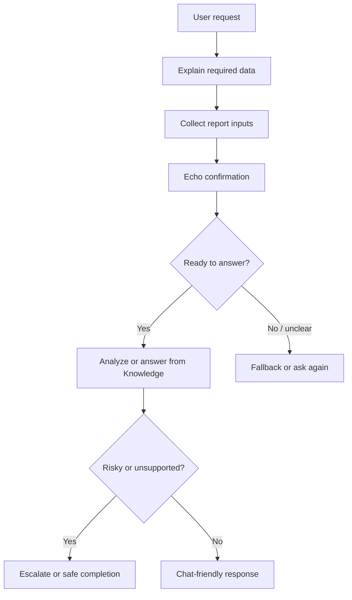

# Module 3.5: Recap & Tutoring Session

หน้านี้เป็นชุดแบบฝึกหัดสำหรับ session ทบทวนประมาณ **1.5 ชั่วโมง** หลังจบ Module 1-3 โดยใช้ **Financial Report Assistant** ที่สร้างไว้ก่อนหน้าเป็นฐาน เป้าหมายคือช่วยให้พวกเรามองเห็นว่า Agent ที่ดีต้องไม่ใช่แค่ตอบได้ แต่ต้องถามข้อมูลที่จำเป็น ยืนยันข้อมูลก่อนทำงาน ไม่เดาคำตอบ และสื่อสารให้ผู้ใช้เข้าใจง่าย

🔑 **ต้องการ M365 Copilot License + สิทธิ์เข้าใช้ Copilot Studio** สำหรับบางส่วนที่ต้องแก้ Topic, System topic หรือ Agent instructions

---

## ก่อนเริ่ม

ควรทำแบบฝึกหัดหลักของ Module 1-3 มาก่อน โดยเฉพาะ

- สร้าง Agent และกำหนด scope จาก Module 1
- สร้าง `Monthly Report Intake` Topic จาก Module 2
- เพิ่ม Prompt node, Knowledge และ Fallback จาก Module 2
- เข้าใจ reliability และ hardening patterns จาก Module 3

> ⚠️ **Note:** ใช้ข้อมูลตัวอย่างจาก repository นี้เท่านั้น ห้ามใส่ข้อมูลการเงินจริง ข้อมูล HR จริง หรือข้อมูลอ่อนไหวลงใน Agent ระหว่างฝึก

---

## Suggested 1.5-Hour Flow

| Exercise | Focus |
|---|---|
| [Exercise 1](./exercise-1-missing-info-detective/README.md) | Missing Info Detective |
| [Exercise 2](./exercise-2-echo-confirmation/README.md) | Echo Confirmation |
| [Exercise 3](./exercise-3-fallback-and-escalation/README.md) | Fallback และ Escalation |
| [Exercise 4](./exercise-4-dont-guess/README.md) | Don't Guess |
| [Exercise 5](./exercise-5-chat-friendly-response/README.md) | Make It Chat-Friendly |

## Table of Contents

| Exercise | Title | Link |
|---|---|---|
| exercise-1-missing-info-detective | Missing Info Detective: ปรับข้อความเก็บข้อมูลให้ชัดเจน | [Open](./exercise-1-missing-info-detective/README.md) |
| exercise-2-echo-confirmation | Echo Confirmation: ยืนยันข้อมูลก่อนวิเคราะห์ | [Open](./exercise-2-echo-confirmation/README.md) |
| exercise-3-fallback-and-escalation | Fallback และ Escalation สำหรับ Agent v1 | [Open](./exercise-3-fallback-and-escalation/README.md) |
| exercise-4-dont-guess | Don't Guess: ตอบจาก Knowledge พร้อม Citation | [Open](./exercise-4-dont-guess/README.md) |
| exercise-5-chat-friendly-response | Make It Chat-Friendly: ปรับคำตอบให้อ่านง่าย | [Open](./exercise-5-chat-friendly-response/README.md) |

## Summary

หลังจบ session นี้ พวกเราควรสามารถอธิบายได้ว่า Agent v1 ของทีมต้องถามข้อมูลอะไร ยืนยันอะไร ตอบจากแหล่งข้อมูลใด เมื่อไรต้อง fallback/escalate และจะทำให้คำตอบอ่านง่ายขึ้นได้อย่างไร
