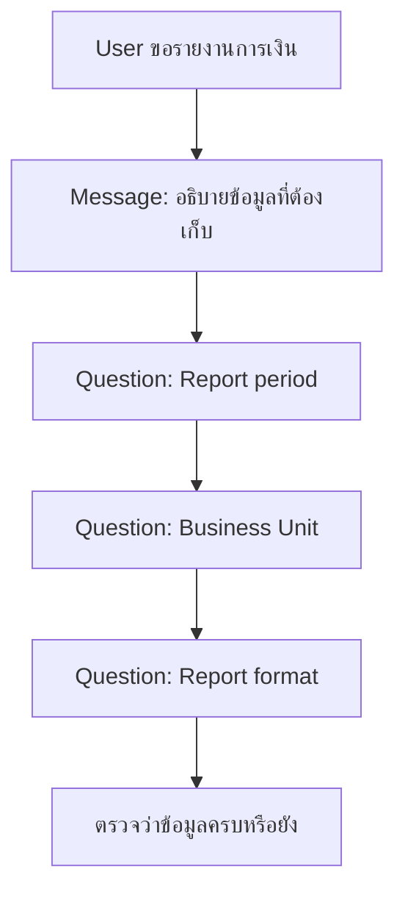

# แบบฝึกหัดที่ 1: Missing Info Detective

🔑 **ต้องการ M365 Copilot License + สิทธิ์เข้าใช้ Copilot Studio**

แบบฝึกหัดนี้จะพาเรากลับไปปรับ **Message node** ตัวแรกใน Topic `Monthly Report Intake` ให้ชัดขึ้น โดยให้ Agent บอกผู้ใช้ก่อนว่าเราจะเก็บข้อมูลอะไร และทำไมต้องเก็บข้อมูลนั้นก่อนเริ่มวิเคราะห์รายงาน



---

## ก่อนเริ่ม

ควรมี Topic `Monthly Report Intake` จาก Module 2 อยู่แล้ว โดยใน Topic นี้ควรมี node ต่อไปนี้

- `Inform about data collection`
- `Ask for report period`
- `Ask for Business Unit`
- `Ask for report format`

> 💡 **Tip:** จุดประสงค์ของ exercise นี้ไม่ใช่เพิ่มคำถามใหม่ แต่ทำให้ข้อความก่อนเริ่มเก็บข้อมูลช่วยลดความสับสนของผู้ใช้

---

## Practice 1: ตรวจข้อความเดิมใน Message node

1. เปิด Agent ที่ใช้ใน Module 2
2. ไปที่ **Topics** แล้วเปิด Topic `Monthly Report Intake`
3. หา Message node ที่ชื่อ

   ```text
   Inform about data collection
   ```

4. อ่านข้อความเดิม แล้วลองตอบคำถามนี้ในใจ
   - ผู้ใช้รู้ไหมว่า Agent จะถามข้อมูลอะไรต่อ
   - ผู้ใช้เข้าใจไหมว่าทำไม Agent ต้องถามข้อมูลนั้น
   - ข้อความนี้ช่วยป้องกัน Agent เดาข้อมูลแทนผู้ใช้หรือยัง

---

## Practice 2: Rewrite ข้อความให้ชัดขึ้น

1. คลิกที่ Message node `Inform about data collection`
2. แก้ข้อความใน Message เป็นข้อความตัวอย่างด้านล่าง หรือปรับให้เข้ากับภาษาของทีม

   ```text
   ก่อนเริ่มวิเคราะห์รายงาน ผมขอเก็บข้อมูลสำคัญ 3 อย่างก่อนนะครับ

   1. ช่วงเวลาของรายงาน เช่น May 2026
   2. Business Unit หรือ BU ที่ต้องการวิเคราะห์
   3. รูปแบบผลลัพธ์ที่ต้องการ เช่น Executive Summary, KPI Summary หรือ Detailed

   ข้อมูลเหล่านี้ช่วยให้ผมสรุปรายงานได้ตรงบริบท และไม่เดาข้อมูลแทนผู้ใช้ครับ
   ```

3. กด **Save** เพื่อบันทึก

> 💡 **Tip:** ข้อความที่ดีควรบอกทั้ง “จะถามอะไร” และ “ถามไปเพื่ออะไร” โดยไม่ยาวเกินไปจนผู้ใช้ไม่อยากอ่าน

---

## Practice 4: ทดสอบใน Test your agent

1. เปิด **Test your agent**
2. ลองพิมพ์คำสั่งนี้

   ```text
   ช่วยทำรายงานการเงินรายเดือน
   ```

3. สังเกตว่า Agent แสดงข้อความอธิบายข้อมูลที่ต้องเก็บก่อนถามคำถามหรือไม่
4. ตรวจว่าผู้ใช้เข้าใจได้ทันทีว่า Agent ต้องใช้ข้อมูลอะไรเพื่อไปต่อ

---

## สรุป

ในแบบฝึกหัดนี้ คุณได้ปรับข้อความใน `Inform about data collection` ให้ช่วยผู้ใช้เข้าใจบริบทก่อนตอบคำถาม ทำให้ Agent ไม่ต้องเดาข้อมูลสำคัญ เช่น เดือน, Business Unit และรูปแบบรายงาน

ขั้นตอนถัดไป → [Echo Confirmation: ยืนยันข้อมูลก่อนวิเคราะห์](../exercise-2-echo-confirmation/README.md)