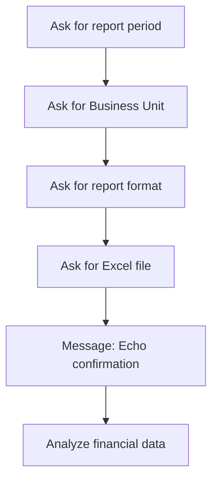

# แบบฝึกหัดที่ 2: Echo Confirmation

🔑 **ต้องการ M365 Copilot License + สิทธิ์เข้าใช้ Copilot Studio**

แบบฝึกหัดนี้จะพาเราเพิ่ม **Message node** หลังจาก node `Ask for Excel file` เพื่อให้ Agent ทวนข้อมูลสำคัญทั้งหมดก่อนส่งต่อไปยัง Prompt node `Analyze financial data` วิธีนี้ช่วยลดความเสี่ยงจากการใช้เดือน, BU, รูปแบบรายงาน หรือไฟล์ผิด



---

## ก่อนเริ่ม

ควรทำ Module 2 Exercise 3 แล้ว โดย Topic `Monthly Report Intake` ควรมี node เหล่านี้

- `Ask for Excel file`
- `Analyze financial data`
- ตัวแปร `Topic.ReportPeriod`
- ตัวแปร `Topic.BusinessUnit`
- ตัวแปร `Topic.ReportFormat`
- ตัวแปร `Topic.SourceFileName`

> ⚠️ **Note:** ใน exercise นี้เราจะเพิ่มจุดยืนยันข้อมูลก่อนวิเคราะห์ ยังไม่ต้องสร้าง flow สำหรับแก้ข้อมูลทีละช่อง

---

## Practice 1: เพิ่ม Message node หลัง Ask for Excel file

1. เปิด Topic `Monthly Report Intake`
2. หา node ที่ชื่อ

   ```text
   Ask for Excel file
   ```

3. ใต้ node นี้ ให้กดปุ่ม **+** แล้วเลือก **Send a message**
4. ตั้งชื่อ node ว่า

   ```text
   Confirm collected report inputs
   ```

5. วาง Message ด้านล่างนี้ แล้วแทรกตัวแปรให้ตรงกับ Topic ของคุณ

   ```text
   เพื่อยืนยันก่อนเริ่มวิเคราะห์นะครับ

   - ช่วงเวลา: {Topic.ReportPeriod}
   - Business Unit: {Topic.BusinessUnit}
   - รูปแบบรายงาน: {Topic.ReportFormat}
   - ไฟล์ข้อมูล: {Topic.SourceFileName}

   ผมจะใช้ข้อมูลนี้ในการวิเคราะห์รายงาน ถ้าข้อมูลไม่ถูกต้อง กรุณาแจ้งแก้ไขก่อนเริ่มนะครับ
   ```

6. ตรวจว่า node นี้อยู่ก่อน `Analyze financial data`
7. กด **Save**

> 💡 **Tip:** การทวนข้อมูลก่อนทำงานจริงช่วยให้ผู้ใช้จับความผิดพลาดได้เร็ว เช่น เลือก BU ผิด หรืออัปโหลดไฟล์ผิด

---

## Practice 2: ตรวจการแทรกตัวแปร

1. คลิกใน Message node ที่เพิ่งสร้าง
2. ใช้ปุ่ม `{x}` หรือเมนูตัวแปรเพื่อเลือกตัวแปรจาก Topic แทนการพิมพ์ชื่อเอง
3. ตรวจสอบว่าตัวแปรที่ใช้ตรงกับชื่อจริงใน Topic

---

## Practice 3: ทดสอบ Echo Confirmation

1. เปิด **Test your agent**
2. เริ่มด้วยคำสั่งนี้

   ```text
   ช่วยทำรายงานการเงินรายเดือนของ BU Aromatics
   ```

3. ตอบคำถามใน flow เช่น

   ```text
   May 2026
   ```

   ```text
   Aromatics
   ```

   ```text
   Executive Summary
   ```

4. เมื่อ Agent ขอไฟล์ ให้ใช้ไฟล์ตัวอย่างจาก Module 2

   ```text
   PTT-Monthly-Financial-Report-May2026.xlsx
   ```

5. สังเกตว่า Agent แสดง Echo confirmation ก่อนเข้า node `Analyze financial data` หรือไม่

Expected result:

- Agent ทวนช่วงเวลา, BU, รูปแบบรายงาน และไฟล์
- ผู้ใช้เห็นข้อมูลสำคัญก่อน Agent วิเคราะห์
- Agent ไม่เริ่มวิเคราะห์ทันทีโดยไม่มีจุดยืนยันข้อมูล

---

## สรุป

ในแบบฝึกหัดนี้ พวกเราได้เพิ่ม Echo confirmation หลัง `Ask for Excel file` เพื่อให้ Agent ทวนข้อมูลสำคัญก่อนวิเคราะห์ ช่วยลดโอกาสใช้ข้อมูลผิดและทำให้ flow ดูน่าเชื่อถือขึ้น

ขั้นตอนถัดไป → [Fallback และ Escalation สำหรับ Agent v1](../exercise-3-fallback-and-escalation/README.md)