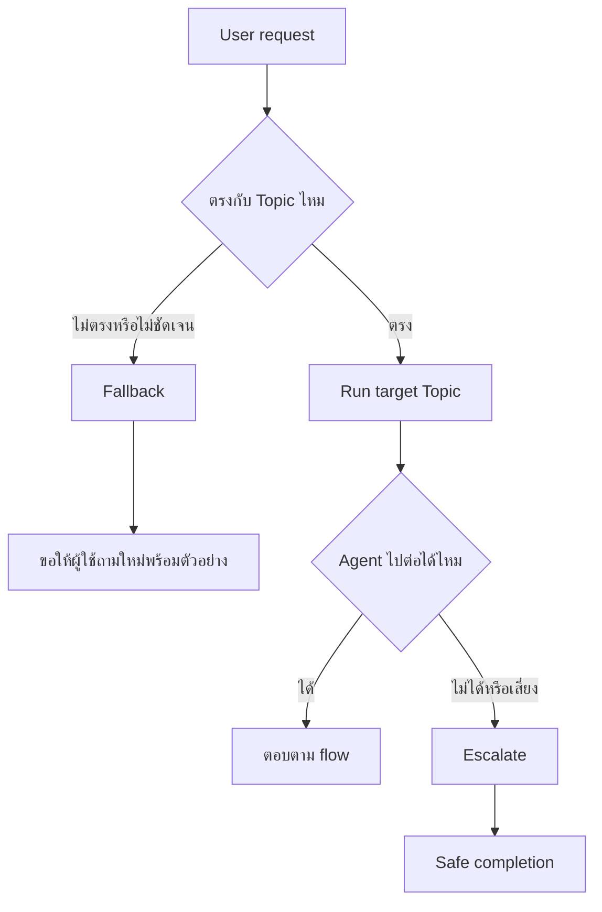
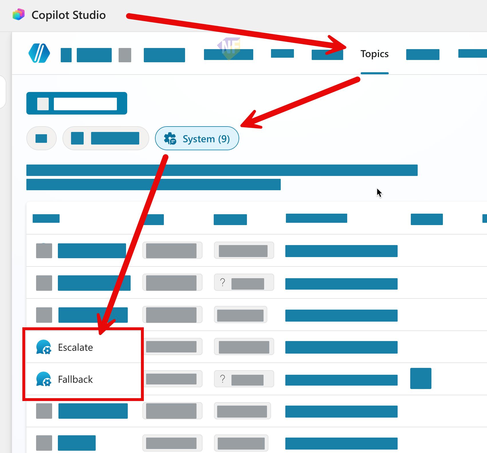
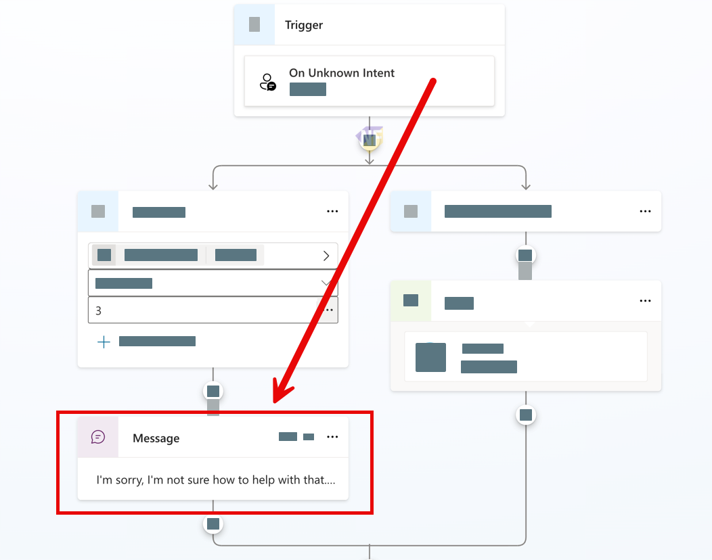

# แบบฝึกหัดที่ 3: Fallback และ Escalation สำหรับ Agent v1

🔑 **ต้องการ M365 Copilot License + สิทธิ์เข้าใช้ Copilot Studio**

แบบฝึกหัดนี้จะพาเราทบทวนการปรับ **Fallback** และ **Escalate** system topics ของ Financial Report Assistant โดยเน้นให้ Agent ไม่เดาคำตอบเมื่อคำถามไม่ชัดเจน และรู้ว่าจะหยุดหรือส่งต่ออย่างปลอดภัยเมื่อคำขอเกินขอบเขต



---

## ก่อนเริ่ม

ควรมี Agent เดิมจาก Module 2 ที่มีอย่างน้อย

- Topic หลักสำหรับงานรายงานการเงิน เช่น `Monthly Report Intake`
- Knowledge สำหรับคำศัพท์รายงานการเงิน
- Instructions ที่กำหนด scope เรื่องรายงานการเงินชัดเจน

> ⚠️ **Note:** `Fallback` และ `Escalate` เป็น system topics ที่ Agent มีมาให้แล้ว ควรแก้อย่างระมัดระวังและทดสอบหลังแก้ทุกครั้ง

---

## Practice 1: ปรับ Fallback system topic ให้ถามกลับอย่างเหมาะสม

1. จากเมนูด้านบนของ Agent ไปที่ **Topics**
2. เลือก **System** แล้วเปิด Topic `Fallback`

   

3. เปิด Message node เดิมของระบบ แล้วดูว่าข้อความตอนนี้ช่วยผู้ใช้ถามใหม่ได้ดีแค่ไหน

   

4. ปรับข้อความใน Message node ให้เหมาะกับงาน Financial Report Assistant

   ```text
   ขอโทษครับ ผมยังจับคำขอนี้ไปยังหัวข้อที่ถูกต้องไม่ได้

   ลองพิมพ์ใหม่โดยระบุเดือน, Business Unit และสิ่งที่ต้องการ เช่น
   - สรุปรายงานเดือน April ของ BU Performance Chemicals
   - วิเคราะห์ต้นทุนเทียบเดือนก่อนหน้า
   - อธิบายความหมายของ EBITDA
   ```

5. กด **Save**


## Practice 2: ปรับ Escalate system topic 

1. ไปที่ **Topics > System > Escalate**
2. ตรวจดูว่า Topic นี้ตอบผู้ใช้อย่างไรเมื่อ Agent ต้องหยุดหรือพาไปหาคนช่วย
3. ปรับข้อความให้เหมาะกับบริบทการเงิน โดยไม่สัญญาว่าระบบจะเปิด ticket หรือส่งต่ออัตโนมัติ หากยังไม่มี flow รองรับ

   ```text
   คำขอนี้อาจต้องให้ผู้รับผิดชอบตรวจสอบเพิ่มเติมครับ
   หากเป็นประเด็นเชิงนโยบาย การอนุมัติการเผยแพร่รายงาน หรือข้อมูลที่ต้องการการยืนยันอย่างเป็นทางการ
   กรุณาติดต่อทีม Finance Analyst หรือ Shared Services ตามช่องทางขององค์กร finance@mail.com หรือโทร 123-4567
   ```

4. ตรวจ trigger phrase ของ Escalate topic เช่น “ขอคุยกับเจ้าหน้าที่” หรือ “ให้คนช่วยต่อ” ว่าตรงกับภาษาที่ผู้ใช้จริงน่าจะใช้หรือไม่
5. กด **Save**
6. ทดสอบ 2 เคสนี้

   ```text
   ขอคุยกับทีม Finance Analyst
   ```

   ```text
   ช่วยตัดสินใจให้หน่อยว่ารายงานนี้ส่งให้ vendor ได้เลยไหม
   ```

Expected result:

- Agent ไม่อนุมัติหรือสัญญาแทนผู้รับผิดชอบ
- Agent บอกเหตุผลที่ต้องส่งต่อหรือหยุด
- Agent เสนอ next step ที่ผู้ใช้ทำต่อได้

---

## สรุป

ในแบบฝึกหัดนี้ คุณได้ปรับ Fallback และ Escalate system topics ให้ Agent ถามกลับอย่างมีบริบทและหยุดอย่างปลอดภัยเมื่อคำขอเสี่ยงหรือเกินขอบเขต

ขั้นตอนถัดไป → [Don't Guess: ตอบจาก Knowledge พร้อม Citation](../exercise-4-dont-guess/README.md)