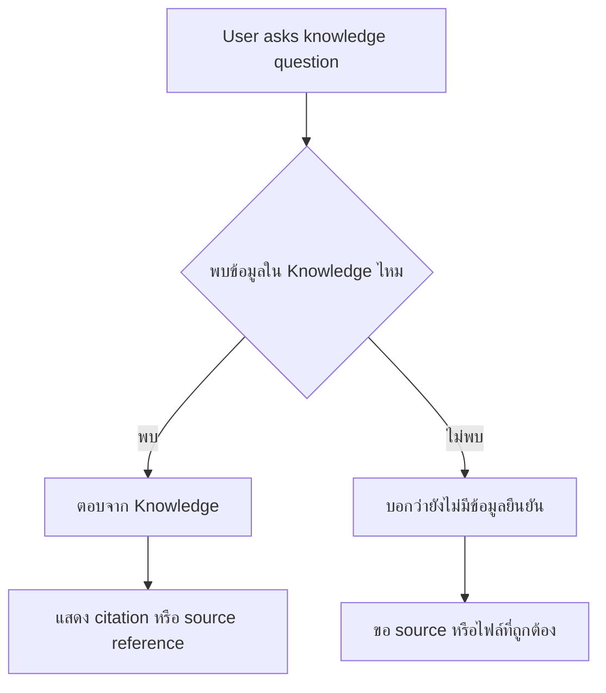

# แบบฝึกหัดที่ 4: Don't Guess

🔑 **ต้องการ M365 Copilot License + สิทธิ์เข้าใช้ Copilot Studio**

แบบฝึกหัดนี้จะพาเราปรับ **Agent instructions** ของ Financial Report Assistant เพื่อให้ Agent ตอบคำถามจาก **Knowledge** อย่างมีหลักฐาน ไม่สร้างข้อเท็จจริงเอง และแสดง citation หรือ source reference เมื่อมีการใช้ข้อมูลจากเอกสารความรู้



---

## ก่อนเริ่ม

ควรทำ Module 2 Exercise 5 แล้ว โดย Agent ควรมี Knowledge อย่างน้อย 1 ไฟล์ เช่น

```text
financial-report-technical-terms-knowledge.docx
```

และควรทดสอบได้ว่า Agent ตอบคำถาม technical terms เช่น `EBITDA margin` หรือ `Variance Percent` ได้

---

## Practice 1: ตรวจว่า Agent มีโอกาสเดาหรือไม่

1. เปิด Agent ของคุณใน Copilot Studio
2. ไปที่หน้า **Overview**
3. เลื่อนลงมาที่ **Instructions** แล้วกด **Edit**
4. อ่าน instructions เดิม แล้วตรวจว่ามี rule เหล่านี้หรือยัง
   - ตอบจาก approved Knowledge เท่านั้น
   - แสดง citation หรือ source reference เมื่อตอบจาก Knowledge

> 💡 **Tip:** ถ้า instructions มีแค่ “ตอบเรื่องรายงานการเงิน” แต่ไม่บอกเรื่อง source, Agent อาจยังตอบแบบกว้างหรือเดาจากความรู้ทั่วไปได้

5. ทดสอบคำถาม Agent อาจเดาได้ เช่น

    ```text
    gross margin คืออะไร?
    ```

ุ6. ตรวจสอบว่าคำตอบของ Agent มี citation หรือ source reference หรือไม่ 

---

## Practice 2: เพิ่ม Grounding และ Citation Rules

ให้แก้ไขข้อความด้านล่างนี้ใน instructions เดิม 

```text
Rules:
- If user asks ...
- If user asks the meaning of financial reporting technical terms,  answer with all  knowledge you have and keep explanation concise. always show the citation from the source you use.
- If request is outside ...
```

กด **Save** หลังเพิ่มข้อความ

> ⚠️ **Note:** การเพิ่ม citation rule ไม่ได้แปลว่า Agent จะสร้าง citation ได้ทุกครั้ง ถ้า Knowledge source หรือ channel ไม่รองรับ citation ชัดเจน ให้ Agent ระบุชื่อ source หรือบอกว่าข้อมูลที่ใช้มาจากเอกสารความรู้ที่เชื่อมไว้แทน

---

## Practice 3: ทดสอบคำถามที่มี Knowledge รองรับ

ใช้ **Test your agent** แล้วถามคำถามนี้

```text
gross margin คืออะไร?
```

สังเกตผลลัพธ์

- Agent อธิบายจาก Knowledge หรือไม่
- มี citation หรือ source reference หรือไม่
- คำตอบยังคงกระชับและเข้าใจง่ายหรือไม่


---

## สรุป

ในแบบฝึกหัดนี้ คุณได้เพิ่ม hardening rule สำคัญให้ Agent ตอบจาก Knowledge อย่างมีหลักฐาน แสดง citation/source reference และไม่เดาสาเหตุ ตัวเลข หรือ policy แทนข้อมูลจริง

ขั้นตอนถัดไป → [Make It Chat-Friendly: ปรับคำตอบให้อ่านง่าย](../exercise-5-chat-friendly-response/README.md)