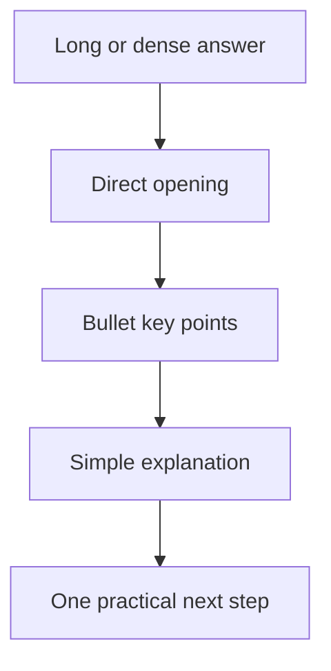

# แบบฝึกหัดที่ 5: Make It Chat-Friendly

🔑 **ต้องการ M365 Copilot License + สิทธิ์เข้าใช้ Copilot Studio**

แบบฝึกหัดนี้จะพาเราปรับ **Agent instructions** ให้คำตอบของ Financial Report Assistant อ่านง่ายขึ้นในแชต โดยยังรักษาความหมายเดิม ขอบเขตเดิม และความปลอดภัยเดิมไว้



---

## Practice 1: เพิ่ม Chat-Friendly Response Rules

1. เปิด Agent ของพวกเราใน Copilot Studio
2. ไปที่หน้า **Overview**
3. เลื่อนลงมาที่ **Instructions** แล้วกด **Edit**
4. เพิ่มข้อความด้านล่างต่อท้าย instructions เดิม

```text
Chat-friendly response rules:
- Answer in clear Thai unless the user asks otherwise.
- Start with the direct answer first, then provide details.
- Use short paragraphs and bullet points for key information.
- Keep responses concise and easy to scan in chat.
- Keep important financial terms in English when it improves clarity, but explain them simply.
- End with one practical next step when useful.
- Do not use long policy-style paragraphs unless the user explicitly asks for full detail.
```

5. กด **Save**

> 💡 **Tip:** คำตอบที่ดีใน chat ไม่จำเป็นต้องสั้นที่สุด แต่ต้องอ่านง่ายและพาผู้ใช้ไปต่อได้

---

## Practice 2: ทดสอบกับคำถามเชิง policy

ใช้ **Test your agent** แล้วถามคำถามนี้

```text
อธิบายความแตกต่างของ EBITDA และ gross margin
```

สิ่งที่คาดหวังจากคำตอบของ Agent:

- Agent ตอบเป็นข้อๆ อ่านง่าย
- Agent ไม่อนุมัติการส่งรายงานแทนผู้รับผิดชอบ
- ถ้าใช้ Knowledge ควรมี citation/source reference ตาม Exercise 4

---

## สรุป

ในแบบฝึกหัดนี้ พวกเราได้ปรับ instructions ให้ Agent ตอบแบบ chat-friendly มากขึ้น โดยคำตอบยังคงถูกต้อง อยู่ในขอบเขต และช่วยให้ผู้ใช้รู้ว่าควรทำอะไรต่อ

จากนี้กลับไปที่ module 3.5 [Recap & Tutoring Session](../README.md) เพื่อสรุปความพร้อมของ Agent v1 ของทีม