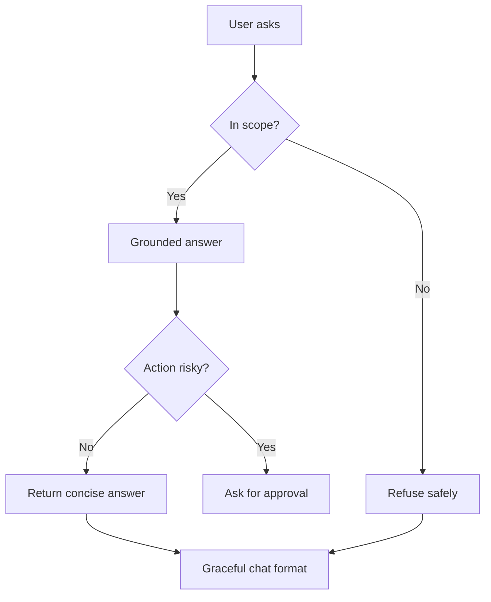

# แบบฝึกหัดที่ 3: Hardening Patterns สำหรับ Agent

แบบฝึกหัดนี้จะพาเรา harden Agent ให้ตอบอย่างมีขอบเขต ชัดเจน และคาดเดาได้มากขึ้น โดยต่อยอดจาก Financial Report Assistant ที่สร้างใน Module 2 และปรับ reliability pattern มาแล้วใน Module 3

🔑 **Copilot Studio ใช้ได้ถ้าต้องการทดลองจริง** แต่แกนหลักของแบบฝึกหัดนี้สามารถทำผ่าน Teams discussion และการ rewrite ข้อความได้



---

## Practice 1: Don’t Guess

Practice นี้ช่วยให้ Agent รู้ว่า ถ้ายังไม่มีข้อมูลยืนยัน ไม่ควรสร้างข้อเท็จจริงหรือสรุปสาเหตุขึ้นเอง

🔧 **เครื่องมือที่ใช้ในห้องเรียน:** Microsoft Teams chat, reaction หรือ Poll

1. ให้ผู้สอนส่งข้อความนี้ใน Teams

   ```text
   User: ช่วยสรุปรายงานเดือน May ให้หน่อย

   Agent: ได้ครับ ยอดขายลดลงเพราะต้นทุนวัตถุดิบสูงขึ้น และ BU Trading มีผลประกอบการต่ำที่สุด
   ```

2. ให้ผู้เรียนโหวตว่า Agent ตอบแบบใด

   - ✅ Agent รู้ข้อมูลนี้จริง
   - ⚠️ Agent กำลังเดาข้อมูล

3. ให้แต่ละทีม rewrite คำตอบใหม่เป็น 1–2 ประโยค โดย Agent ไม่เดาข้อเท็จจริงที่ยังไม่มีข้อมูลยืนยัน

4. เปิดแต่ละ challenge ต่อไปนี้ทีละข้อ ให้ผู้เรียนโหวตใน Teams แล้วเขียนคำตอบที่ปลอดภัยกว่าใน chat

   <details>
   <summary>Challenge A: Product Operations Agent</summary>

   ```text
   User: เครื่องจักร Line 2 มีสัญญาณเตือน ช่วยบอกสาเหตุให้หน่อย

   Agent: สาเหตุเกิดจากชิ้นส่วนหลักเสื่อมสภาพ และควรหยุดเครื่องทันทีครับ
   ```

   </details>

   <details>
   <summary>Challenge B: Marketing Agent</summary>

   ```text
   User: ทำไม Summer Campaign ถึงได้ผลไม่ดี

   Agent: Campaign ได้ผลไม่ดีเพราะลูกค้า Gen Z ไม่สนใจข้อความโฆษณาครับ
   ```

   </details>

   <details>
   <summary>Challenge C: Researcher Agent</summary>

   ```text
   User: ตลาดรถยนต์ไฟฟ้าในประเทศไทยปีหน้าจะเป็นอย่างไร

   Agent: ตลาดจะเติบโตอย่างมากแน่นอน เพราะผู้บริโภคพร้อมเปลี่ยนมาใช้รถยนต์ไฟฟ้าแล้วครับ
   ```

   </details>

5. ไม่มีคำตอบตัวอย่างสำหรับ challenge เหล่านี้ ให้แต่ละทีมตอบคำถามนี้ก่อน rewrite

   - Agent เดาข้อเท็จจริงอะไร
   - Agent ควรบอกข้อจำกัดหรือขอข้อมูลอะไรเพิ่ม
   - Agent จะช่วยผู้ใช้ต่อได้อย่างไรโดยไม่สร้างข้อมูลขึ้นเอง

6. ปิดท้ายด้วยกติกาสั้นๆ ที่ทุกคนใช้ร่วมกัน

   > ถ้าไม่มีข้อมูลยืนยัน Agent ไม่ควรเดา ควรบอกข้อจำกัดหรือขอข้อมูลที่จำเป็นเพิ่ม

---

## Practice 2: Stay in Scope

Practice นี้ช่วยให้ Agent รู้ว่าเรื่องใดอยู่ในขอบเขตของตนเอง และควร redirect ผู้ใช้อย่างไรเมื่อคำขออยู่นอกขอบเขต

🔧 **เครื่องมือที่ใช้ในห้องเรียน:** Microsoft Teams chat, reaction หรือ Poll

> **💡 Note:** คำขอที่อยู่นอก scope ควร redirect ไปยังผู้รับผิดชอบที่เหมาะสม ส่วนคำขอที่อยู่ใน scope แต่มีความเสี่ยงหรือเกี่ยวกับการอนุมัติ ให้ใช้แนวคิด Escalate จาก Exercise 2

1. ให้ผู้สอนส่งข้อความนี้ใน Teams

   ```text
   Agent scope: ช่วยเรื่องรายงานการเงิน คำศัพท์ทางการเงิน และนโยบายการเผยแพร่รายงาน

   User: ช่วยตรวจสอบสิทธิ์ลางานให้หน่อย

   Agent: คุณยังมีวันลาพักร้อนเหลือ 8 วันครับ
   ```

2. ให้ผู้เรียนโหวตว่า Agent ควรตอบคำขอนี้หรือไม่

   - ✅ อยู่ใน scope
   - 🚫 อยู่นอก scope

3. เฉลยและใช้คำตอบนี้เป็นแนวทางสำหรับ challenge ต่อไป

   ```text
   ผมช่วยเรื่องรายงานการเงิน คำศัพท์ทางการเงิน
   และนโยบายการเผยแพร่รายงานเป็นหลักครับ

   สำหรับการตรวจสอบสิทธิ์ลางาน
   แนะนำให้ติดต่อ HR หรือใช้ Agent ที่ดูแลเรื่องบุคลากรโดยตรงครับ
   ```

   สังเกตรูปแบบคำตอบ 2 ส่วน:

   - บอกสั้นๆ ว่า Agent ช่วยเรื่องใด
   - Redirect ผู้ใช้ไปยังทีม หรือ Agent ที่เหมาะสม โดยไม่อ้างว่าดำเนินการให้แล้ว

4. เปิดแต่ละ challenge ต่อไปนี้ทีละข้อ ให้ผู้เรียนโหวตใน Teams แล้วเขียนคำตอบ redirect ที่ปลอดภัยกว่าใน chat

   <details>
   <summary>Challenge A: Product Operations Agent</summary>

   ```text
   Agent scope: ช่วยดูสถานะการผลิต, downtime และข้อมูลการปฏิบัติงาน

   User: ช่วยอนุมัติวันลาของทีมช่าง Line 2 ให้หน่อย

   Agent: ได้ครับ ผมอนุมัติวันลาของทีมช่าง Line 2 ให้แล้ว
   ```

   </details>

   <details>
   <summary>Challenge B: Marketing Agent</summary>

   ```text
   Agent scope: ช่วยวิเคราะห์ campaign, กลุ่มลูกค้า และผลการตลาด

   User: ช่วย reset รหัสผ่านระบบบัญชีให้หน่อย

   Agent: ได้ครับ ผม reset รหัสผ่านระบบบัญชีให้แล้ว
   ```

   </details>

   <details>
   <summary>Challenge C: Researcher Agent</summary>

   ```text
   Agent scope: ช่วยค้นคว้า สรุปข้อมูลตลาด และวิเคราะห์ข้อมูลวิจัย

   User: ช่วยอนุมัติสัญญาของ vendor รายนี้ให้หน่อย

   Agent: ได้ครับ สัญญานี้ผ่านการอนุมัติแล้ว และส่งให้ vendor ลงนามได้ทันที
   ```

   </details>

5. ไม่มีคำตอบตัวอย่างสำหรับ challenge เหล่านี้ ให้แต่ละทีมตอบคำถามนี้ก่อน rewrite

   - คำขอนี้อยู่นอก scope ของ Agent เพราะอะไร
   - Agent ควรบอกว่าตนช่วยเรื่องใดได้
   - ผู้ใช้ควรไปต่อกับทีม หรือช่องทางใด

6. แชร์คำตอบ redirect ที่ทีมคิดว่าดีที่สุดใน Teams chat พร้อมอธิบาย 1 บรรทัดว่า Agent รักษาขอบเขตของตนเองอย่างไร

---

## Practice 3: Approval Before Action

1. ลองพิจารณาคำขอที่อาจมีความเสี่ยง เช่น

   ```text
   User: ช่วยเตรียม summary นี้แล้วส่งให้ผู้บริหารเลย
   ```

2. ให้ทีมออกแบบข้อความยืนยันก่อน action

   ```text
   เพื่อยืนยันนะครับ ต้องการให้ผมเตรียม summary สำหรับผู้บริหารจากข้อมูลชุดนี้ก่อน
   หากขั้นตอนถัดไปเกี่ยวข้องกับการส่งต่อหรือเผยแพร่รายงาน ควรให้ผู้รับผิดชอบตรวจสอบอีกครั้งก่อนดำเนินการ
   ```

3. พวกเรามาออกไอเดียกัน ว่ามี action ไหนบ้างที่ Agent ไม่ควรทำทันทีโดยไม่มี approval

---

## Practice 4: Rewrite for Chat Format

1. ให้ผู้สอนเตรียมข้อความ policy หรือคำอธิบายยาว 1 ย่อหน้า
2. ให้แต่ละทีม rewrite ให้อ่านง่ายในแชต โดยใช้หลักต่อไปนี้
   - สั้น
   - เป็นข้อ
   - ใช้น้ำเสียงที่เป็นมิตร
3. ตัวอย่างรูปแบบ

   ```text
   สรุปให้สั้นๆ ครับ
   - ใช้รายงานฉบับเต็มเฉพาะผู้มีสิทธิ์เข้าถึง
   - ตรวจสอบ approval chain ก่อนส่งต่อ
   - หากไม่แน่ใจ ให้ส่งต่อทีมที่รับผิดชอบก่อนเผยแพร่
   ```

---

## สรุป

ในแบบฝึกหัดนี้ คุณได้ฝึก hardening pattern สำคัญ 4 ด้านคือ **Grounded answer**, **Refuse safely**, **Approval before action**, และ **Chat-friendly response format**

ขั้นตอนถัดไป → [เลือก Channel และ Publish Agent](../exercise-4-channel-and-publishing/README.md)
